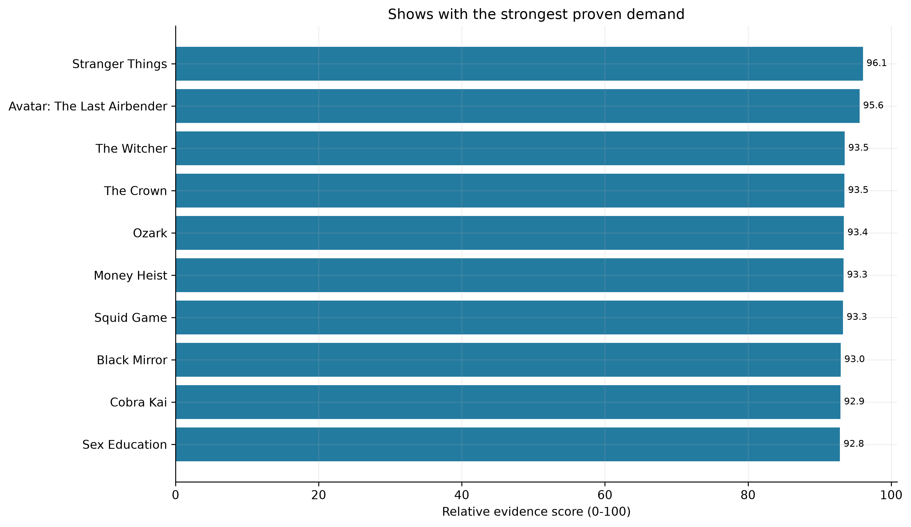
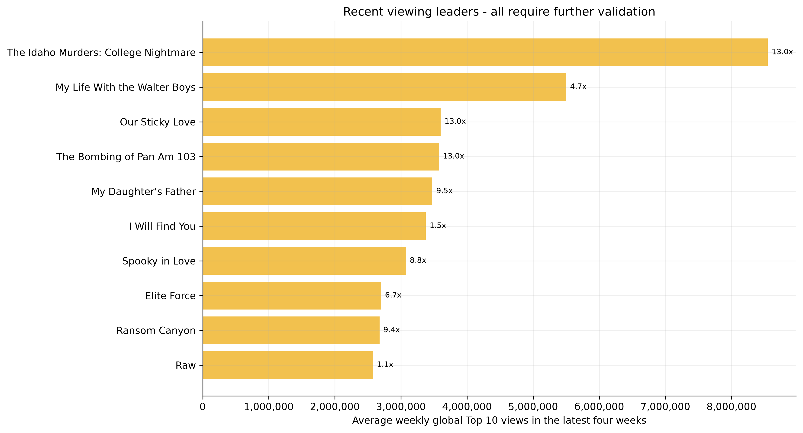
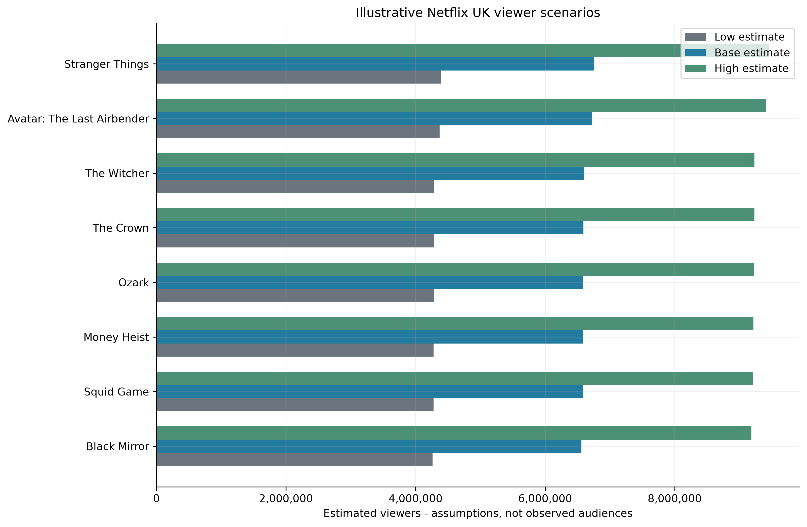

# Netflix UK Content Demand Analysis

## Project overview

I built this project while learning Python for data analysis. I wanted to move beyond a general exploratory notebook and answer a question that could come up in a real content or commercial team:

> **Which television shows should be shortlisted for further acquisition, licensing or recommissioning research?**

I used pandas to import, inspect, clean, combine and analyse three datasets. I then used Matplotlib to create charts showing proven demand, current momentum and estimated viewer scenarios.

The result is an early screening tool, not a claim that Netflix should buy a particular show. The available data does not include confirmed rights, licence costs, UK title-level audiences or original UK viewing figures. I left those fields empty instead of making up numbers. For me, that was an important part of the project: knowing when the data cannot answer a question is just as important as calculating a score.

## What I found

- **Stranger Things had the strongest overall evidence score (96.1).** It combined a high IMDb rating, the largest IMDb vote count in the leading group and 34 weeks in the global Top 10.
- **Squid Game had 396.9 million reported views and 42 Top 10 weeks** but ranked seventh overall because the score also considers rating, vote depth and comparable viewing hours.
- **A large momentum ratio does not always mean reliable growth.** A newly appearing title can have a high four-week-to-12-month ratio after only one successful week. I therefore show the ratio beside Top 10 longevity and flag possible short-term spikes.
- **Demand is only the start of the decision.** None of the candidates can pass a genuine acquisition test until rights availability and cost are confirmed.

## Main tools demonstrated

- Python
- pandas
- NumPy
- Matplotlib
- Jupyter Notebook

The notebook demonstrates CSV imports with `usecols`, `dtype` and `parse_dates`; data inspection with `info`, `describe`, null counts and duplicate checks; deliberate missing-value handling; string cleaning; numeric conversion; named `groupby` aggregations; left joins; boolean filtering; ranking; `melt` and `pivot`; date-based comparisons; and publication-ready Matplotlib charts.

## How I used pandas

I used pandas for the full data-cleaning and analysis process rather than only using it to open the files.

### Importing and inspecting the data

- Loaded three CSV files with `pd.read_csv()`.
- Used `usecols` so the notebook imports only the fields needed for the analysis.
- Set text columns with `dtype` and converted date columns while importing with `parse_dates`.
- Used `.shape`, `.info()` and `.describe()` to understand the size, structure and content of each dataset.
- Checked missing values with `.isnull().sum()` and duplicate records with `.duplicated().sum()`.

### Cleaning the data

- Removed records only when an essential title or date was missing.
- Removed exact duplicate rows with `.drop_duplicates()`.
- Converted ratings, votes, viewing hours and views into numeric fields with `pd.to_numeric(errors="coerce")`.
- Removed commas from IMDb vote counts before converting them from text.
- Cleaned title text with `.str.strip()`, `.str.lower()` and regular expressions so titles could be matched across different files.
- Preserved unavailable commercial information as `NaN` rather than replacing unknown values with zero.

### Transforming and combining the data

- Used `.groupby().agg()` with named aggregations to calculate total viewing hours, total views, best rank and weeks in the Top 10.
- Combined different seasons belonging to the same programme before calculating show-level results.
- Created a complete 52-week calendar with `pd.date_range()` and `MultiIndex.from_product()` so weeks without a Top 10 appearance were counted consistently.
- Used left `.merge()` operations to add IMDb and catalogue information without dropping shows that failed to match.
- Used boolean masks to filter titles with current viewing activity.
- Used `.rank(pct=True)` to put different demand measures onto comparable percentile scales.
- Used `np.select()` and `np.where()` to create reliability, demand-pattern and recommendation labels.
- Used `.melt()` and `.pivot()` to reshape the Low, Base and High viewer scenarios for visualization.
- Exported the final decision table and research templates with `.to_csv()`.

## How I used Matplotlib

I used Matplotlib as the presentation layer for the analysis. Each chart was selected because it supports a specific business decision.

- Applied one consistent colour palette and shared formatting through `plt.rcParams`.
- Used `plt.subplots()` so each figure and axis could be formatted directly.
- Created horizontal bar charts with `ax.barh()` because programme titles are easier to read horizontally.
- Added value labels with `ax.bar_label()` so the reader does not have to estimate results from the axis.
- Formatted large audience numbers with `matplotlib.ticker` and comma separators.
- Added titles and axis labels that explain what each measure represents and where it should be used cautiously.
- Used grouped bars to compare Low, Base and High viewer scenarios for the same title.
- Saved every figure with `dpi=300` and `bbox_inches="tight"` so the images remain clear in the GitHub README and portfolio documents.

The three visuals have separate purposes:

1. **Proven demand chart:** identifies which shows should enter commercial research first.
2. **Recent viewing chart:** identifies current viewing leaders while warning that they still need reliability checks.
3. **Viewer scenario chart:** compares the effect of cautious, central and optimistic assumptions without presenting estimates as observed audiences.

## Business questions and how I answered them

### 1. Which shows have the strongest proven demand?

I combined four pieces of evidence:

- IMDb rating: 30%
- IMDb vote depth: 25%
- observed global Netflix Top 10 viewing hours: 30%
- number of weeks in the Top 10: 15%

I used viewing hours in the score because that field covers the full dataset history. The newer weekly-views measure is missing for older weeks, so using it in the score would unfairly favour more recent titles. Total views are still shown as supporting information where available.

The result is a relative evidence score, not a probability or forecast. I chose these weights to keep the method simple and transparent; a real content team could replace them with its own priorities. The strongest results in the supplied data were:

| Rank | Show | IMDb rating | IMDb votes | Global Top 10 views | Weeks in Top 10 | Demand score |
|---:|---|---:|---:|---:|---:|---:|
| 1 | Stranger Things | 8.7 | 1,149,902 | 369.0m | 34 | 96.1 |
| 2 | Avatar: The Last Airbender | 9.3 | 309,241 | 102.5m | 12 | 95.6 |
| 3 | The Witcher | 8.2 | 481,841 | 83.4m | 18 | 93.5 |
| 4 | The Crown | 8.7 | 199,898 | 43.9m | 18 | 93.5 |
| 5 | Ozark | 8.5 | 309,552 | Not reported | 13 | 93.4 |



### 2. Which shows have growing current interest?

I calculated:

`momentum ratio = recent four-week average / trailing 12-month weekly average`

The averages use a complete weekly calendar. A week without a Top 10 appearance is counted as zero observed Top 10 views. This avoids overstating demand by averaging only successful weeks.

A ratio above 1 means recent viewing is higher than the trailing-year weekly average. However, a new title with only one recent appearance can produce a ratio of 13 because its four-week average is being compared with a 52-week average. The chart therefore ranks titles by recent viewing level and shows the ratio as a label. None of the ten recent-viewing leaders passed the full reliability screen, so the visual presents them as monitoring candidates rather than proven long-term opportunities.



### 3. Is the demand reliable or temporary hype?

I needed a simple way to separate an established audience from a short spike, so I created a screening rule. A show receives the `reliable_demand` flag when it has:

- at least four separate Top 10 weeks,
- at least 25,000 IMDb votes, and
- an IMDb rating of at least 7.0.

A sharp increase with two or fewer Top 10 weeks is labelled as a possible short-term spike. These thresholds are analyst assumptions and can be changed if the business has better internal standards.

Previous-season UK audience data was not supplied, so the reliability flag is supporting evidence rather than final proof.

### 4. Which shows are realistically obtainable?

The historical catalogue and viewing files cannot confirm present UK rights. I therefore created explicit fields for:

- rights status,
- current platform,
- production status, and
- confirmed release date.

Every candidate remains on hold until those fields are verified. This prevents the demand score from being mistaken for an acquisition recommendation.

### 5. How many Netflix UK viewers might each show attract?

I created Low, Base and High planning scenarios. They are clearly labelled as illustrative estimates because no Netflix UK title-level training data was available.

- Base: `750,000 + 6,250,000 × demand score / 100`
- Low: 65% of Base
- High: 140% of Base

The formula provides a consistent sensitivity range, but it must be recalibrated with real Netflix UK results before being used commercially.



### 6. Would the expected value justify the cost?

I set up the notebook to calculate:

- projected value,
- known total licence cost,
- benefit-cost ratio,
- projected ROI, and
- break-even viewers.

The illustrative value assumption is £2.50 per viewer. Licence costs remain blank, so ROI and benefit-cost results also remain blank. Unknown cost is never treated as zero.

### 7. How sensitive is the recommendation?

The notebook tests whether a show would cover its cost in the Low scenario and whether it would succeed only in the High scenario. These flags become meaningful after verified licence costs are entered into the research template.

### 8. What information is still missing?

| Missing information | Preferred source | Why it matters |
|---|---|---|
| Original UK audience | BARB or broadcaster reports | Confirms previous-season UK demand |
| Google Trends history | Downloaded Google Trends data | Measures current UK search interest |
| Netflix UK title audience | Internal Netflix analytics | Calibrates viewer estimates |
| Licence cost | Distributor quotation | Required for ROI and break-even |
| Rights availability | Distributor or legal team | Determines whether a title is obtainable |
| Current platform | Current rights research | Identifies exclusivity conflicts |
| Production status | Studio or reliable trade source | Shows whether more episodes are realistic |
| Confirmed release date | Studio or broadcaster | Supports launch timing |

## Repository structure

```text
python-for-data-analysis/
├── data/
│   ├── imdb_ratings.csv
│   ├── netflix_titles.csv
│   ├── netflix_weekly_top10.csv
│   └── README.md
├── images/
│   ├── current_momentum.png
│   ├── proven_demand.png
│   └── viewer_scenarios.png
├── outputs/
│   ├── acquisition_decision_table.csv
│   ├── data_gap_register.csv
│   └── shortlist_research_template.csv
├── netflix_content_demand_analysis.ipynb
├── requirements.txt
└── README.md
```

## How to run the project

1. Clone or download this repository.
2. Open a terminal in the project folder.
3. Install the required packages:

   ```bash
   pip install -r requirements.txt
   ```

4. Open `netflix_content_demand_analysis.ipynb` in Jupyter Notebook or VS Code.
5. Select **Restart Kernel and Run All**.

The notebook reads the included CSV files using relative paths, so it does not require my computer, database or SQL Server connection.

## Data notes

The repository contains the three educational datasets used by the notebook so the analysis is reproducible. See [`data/README.md`](data/README.md) for the file descriptions and provenance limitations.

The weekly viewing data represents global Netflix Top 10 activity, not Netflix UK audiences. IMDb title matching uses a cleaned title and keeps the record with the largest vote count. This is suitable for an initial portfolio analysis, but remakes and titles sharing the same name should be checked manually before a commercial decision.

## Potential business decisions

The analysis supports four decisions Netflix could make:

1. **Prioritise commercial checks for the strongest titles.** Stranger Things, Avatar: The Last Airbender, The Witcher, The Crown and Ozark should move first into rights, cost and UK-audience research because they have the strongest combined evidence.
2. **Separate established demand from recent spikes.** Titles with high recent viewing but limited history should be monitored or tested with targeted marketing rather than treated as proven long-term demand.
3. **Use the viewer scenarios for planning, not approval.** The Low, Base and High estimates show the effect of changing assumptions, but they should not justify a deal until calibrated with Netflix UK title-level results.
4. **Apply a commercial stop/go gate.** A title should proceed only when rights are confirmed and its known cost passes the Low or Base benefit-cost test. A title that works only in the High scenario should be treated as higher risk.

The immediate decision is therefore to create a small diligence shortlist, not approve an acquisition. My next step would be to collect UK Google Trends exports, original UK audience figures, confirmed rights and indicative licence costs for the leading titles. I would then replace the illustrative viewer formula with one calibrated on real UK performance.

The main business takeaway is that audience demand can justify further investigation, but it cannot by itself prove that a title is obtainable or profitable.
